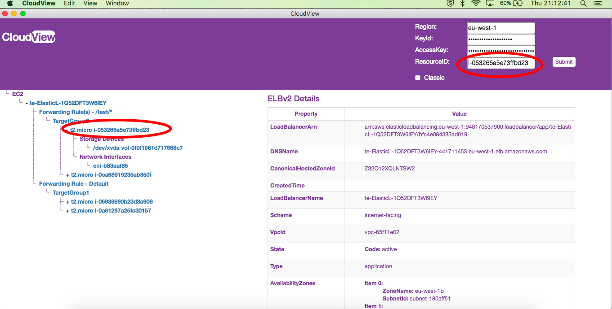

# cSeeTwo
Will display AWS EC2 - ELB, ELBv2, Instances, Volumes and Network Interfaces in tree view. Besides the AWS Region, Access Key Id and Secret Access Key, it takes the AWS Resource ID of Instance, Volume and Network Interface, where as takes the ELB/ELBv2 name.

It only takes one ID and return the full tree.

Inputs:
- AWS Region ex: eu-west-1
- Access Key Id: AHSKSKNKJBKBKHHHHA
- Secret Access Key: ASASAS/SDASDFF8ASSAFASFS
- Resource ID: Instance ID, Volume ID, Network Interface ID or ELB/ELBv2 name
- Classic Check box: Default checked for ELB, Uncheck if you know the tree top is ELBv2, else try with both checked and unchecked

The application uses Javascript AWS SDK https://github.com/aws/aws-sdk-js to describe the resources and Electron https://github.com/electron/electron for the application.

# Dependencies
Tested on the following combinations, however should work across all versions
- node > v7.9.0
- npm > 4.2.0

# To install
npm install

# To run cSeeTwo
npm start

# To build an app for MAC
npm run build

The application will be available in dir cSeeTwo-darwin-x64/ as cSeeTwo.app
