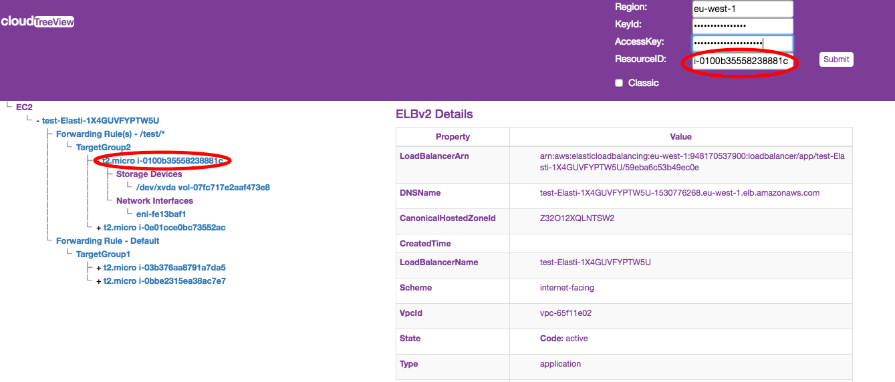

# cloudTreeView
Will display AWS EC2 - ELB, ELBv2, Instances, Volumes and Network Interfaces in tree view. Besides the AWS Region, Access Key Id and Secret Access Key, it takes the AWS Resource ID of Instance, Volume and Network Interface, where as takes the ELB/ELBv2 name.

It only takes one ID and return the full tree.

Inputs:
- AWS Region, ex: eu-west-1
- Access Key Id, ex: AHSKSKNKJBKBKHHHHA
- Secret Access Key, ex: ASASAS/SDASDFF8ASSAFASFS
- Resource ID: Instance ID, Volume ID, Network Interface ID or ELB/ELBv2 name
- Classic Check box: Default checked for ELB, Uncheck if you know the tree top is ELBv2, else try with both checked and unchecked

## User permission required
AmazonEC2ReadOnlyAccess - http://docs.aws.amazon.com/directoryservice/latest/admin-guide/role_ec2_read_only.html

The application uses Javascript AWS SDK https://github.com/aws/aws-sdk-js to describe the resources, Electron https://github.com/electron/electron and http://getbootstrap.com/ for the application.

## An example tree view

An example tree view when the input given was an instance id. See that cloudTreeView has fetched the volumes and eni for the given instances id along with all the children of the top elb node.

## Dependencies
Tested on the following combinations, however should work across all versions
- node > v7.9.0
- npm > 4.2.0

## To install
cd cloudTreeView
npm install

## To run cloudTreeView
cd cloudTreeView
npm start

## To build an app for MAC
cd cloudTreeView
npm run build

The application will be available in dir cloudTreeView-darwin-x64/ as cloudTreeView.app
